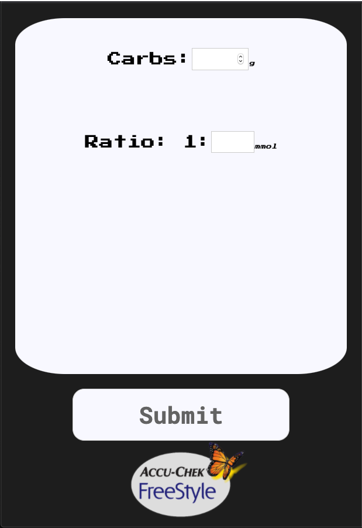

# Projects Guide

This is a collection of some of the projects that I've done after graduating from [Makers Academy](https://makers.tech/). I also completed a lot of projects throughout my time spent at Makers. If you're interested you can check out some of them in my [Makers Portfolio Repository](https://github.com/kealanheena/makersPortfolio).

## [Studio Ghibli API](https://github.com/kealanheena/studio_ghibli_api)

  

 
This is an app that displays all of the Studio Ghibli movies as well as their rating and release date using an API. You can change the order they are displayed in, you can choose to organise them by alphabetical order, rating(highest to lowest) and release date(newest to oldest).
  
I did this project so that I could get a better grasp on how API's work so I grabbed a Studio Ghibli API amd run with it. I messed around with the API trying different ways of getting and formating the imformation until I understood it. I used Ruby because I had used JavaScript to collect infomation from an API before and wanted to try something different.
 

## [Calculator React](https://github.com/kealanheena/calculator_react)

  

 
A simple Calculator app created in React using TDD(test driven development) with Jest and Enzyme.
  
The main reason I did this project was because I wanted to learn React and I found a blog that took you through the steps of making a calculator in react through TDD. So I worked my way through the blog using Enzyme and Jest to test it along the way. After doing that I was feeling quite confident about building something in React through TDD.
 

## [Glucometer](https://github.com/kealanheena/glucometer)

  

 
what is a glucometer?
  
A glucometer is a home measurement system you can use to test the amount of glucose(sugar) in your blood.
  
This glucometer doesn't check your blood sugars but it's based off the ACCU-CHEK Aviva Expert, which is a glucometer that calculates your bolus (the amount of units of insulin you need) based on the amount of carbs you are eating and your insulin ratio(this is known as carb counting). It's built in React through the TDD process using Enxyme and Jest.
  
The reason behind this project is somewhat more persomnal than the others. I'm a diabetic(that's how I know about glucometers) and I thought it would be a good idea to build an app that calculates your bolus to make carb counting easier because one day my glucometer broke. I do have a spare but they don't have the carb counting feature so I had to do that manually until I got a new glucometer. Obviously that was a huge inconvenience so I though why not make that feature into an app and thus this project was born. I was really glad to get it done and I got to test the react skills I had learned from the calculator.
 

## Before Makers
## [YelpCamp](https://blooming-cliffs-37846.herokuapp.com/)

  

 
This was my first full-stack project using a MEN stack. It's a camping app where you can authenticate users, add, edit, view and delete campsites and comments on a campsite, and make a reservation.
  
I started this project before makers to prepare me for the intensive bootcamp. I wanted to have a bit of understanding of software engineering before starting Makers so that I could hit the ground running. It was a Udemy course that taught HTML, CSS and JavaScript as well as some other things.
 

## Things I've Been Practicing
- [JavaScript & JQuery](https://github.com/kealanheena/javascript_practice) - I did three Udemy courses to improve my JavaScript & JQuery and did a small project at the end of each.
- [React](https://github.com/kealanheena/react) - I did a React course to get an understanding of React before starting any projects.
- [Code Wars Katas](https://www.codewars.com/users/kealanheena) - I practice by doing Katas on Code Wars which helps improve my problem solving and logical thinking.
- [Makers Reviews](https://github.com/kealanheena/review_three) - I've been doing reviews at Makers that help me improve my process. These are small code examples that I do while a reviewer watches and takes notes and gives me feed back on my process.
